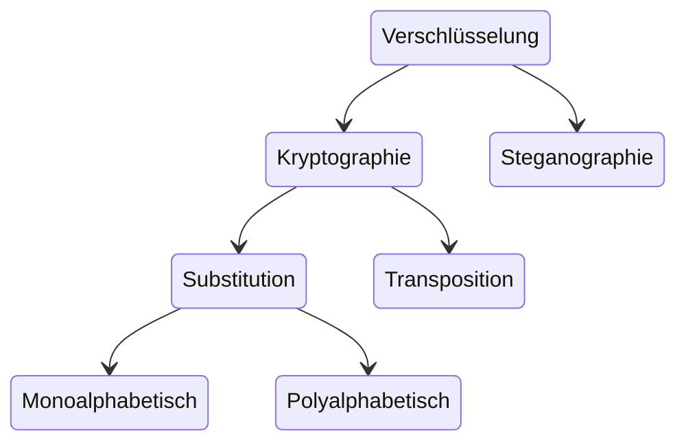

```mermaid
stateDiagram
    Verschlüsselung --> Kryptographie
    Verschlüsselung --> Steganographie
    Kryptographie --> Substitution
	Kryptographie --> Transposition
	Substitution --> Monoalphabetisch
	Substitution --> Polyalphabetisch
```

[[Verschlüsselungsverfahren]]

#### Verschlüsselungssysteme:
[[Symetrisches Kryptosystem]]
[[Asymetrisches Kryptosystem]]
[[Hybrides Kryptosystem]]
